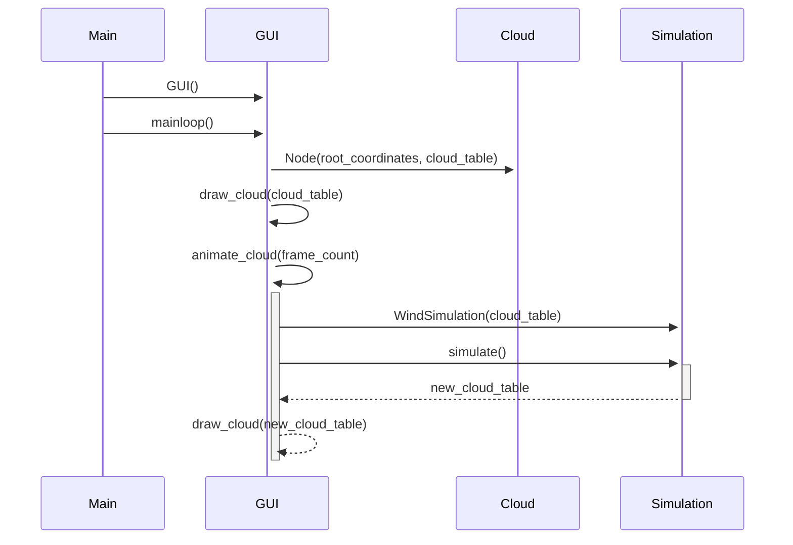

#Basic functionality
##Drawing and animation of clouds

```mermaid
sequenceDiagram
Main->>+GUI: GUI()
Main->>GUI: mainloop()
GUI->>+Cloud: Node(root_coordinates, cloud_table)
GUI->>+GUI: draw_cloud(cloud_table)
GUI->>+GUI: animate_cloud(frame_count)
GUI->>+Simulation: WindSimulation(cloud_table)
GUI->>+Simulation: simulate()
Simulation-->>-GUI: new_cloud_table
GUI-->>-GUI: draw_cloud(new_cloud_table)
```
