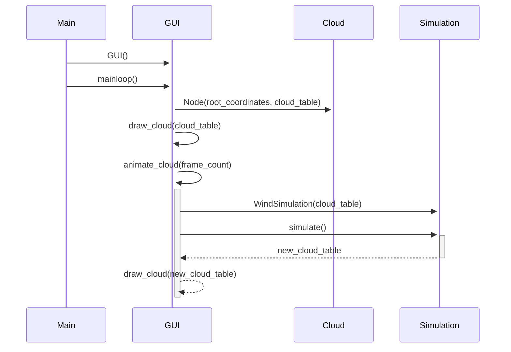

# Basic functionality
## Drawing and animating the clouds
When the application is started, a cloud is immediately generated and drawn.  
When the user clicks the "generate a new cloud" button, a new cloud is generated and drawn to replace the old.  
The animate button initiates a loop, whcih uses the WindSimulation algorithm to slightly change the cloud frame by frame.  
Each frame is drawn before the next is generated.  

