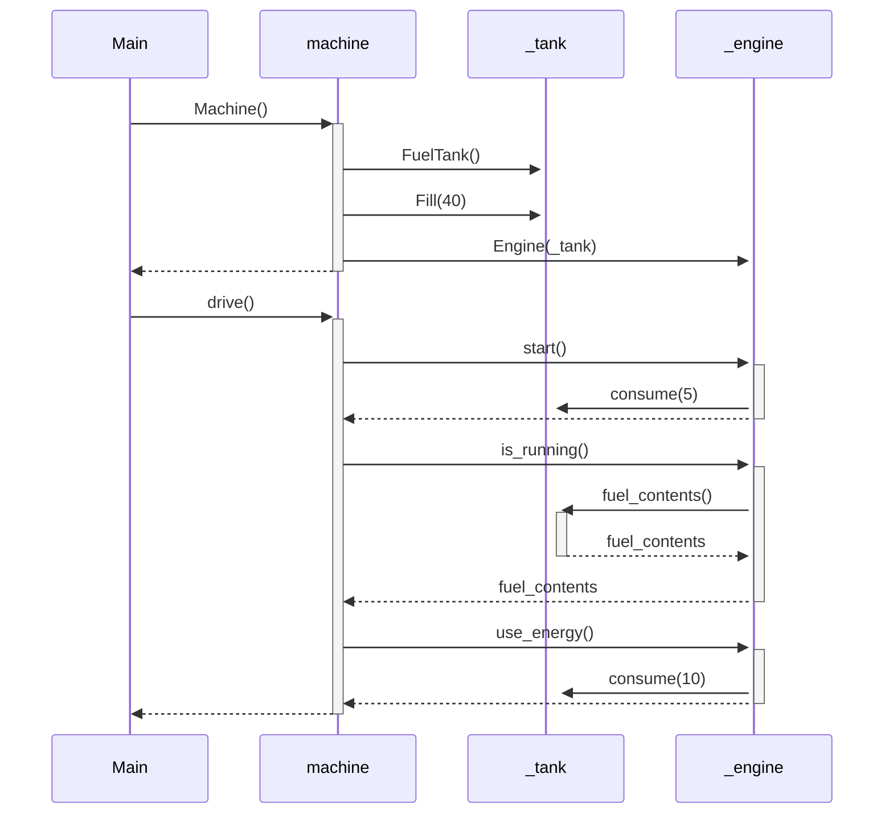

```mermaid
  sequenceDiagram
      Main->>+machine: Machine()
      machine->>+_tank: FuelTank()
      machine->>+_tank: Fill(40)
      machine->>+_engine: Engine(_tank)
      machine -->>- Main: 

      Main->>+machine: drive()
      machine->>+_engine: start()
      _engine->>+_tank: consume(5)
      _engine-->>-machine: 
      machine->>+_engine: is_running()
      _engine->>+_tank: fuel_contents()
      _tank-->>-_engine: fuel_contents

      _engine-->>-machine: fuel_contents
      machine->>+_engine: use_energy()
      _engine->>+_tank: consume(10)
      _engine -->>- machine: 
      machine -->>- Main: 
```
