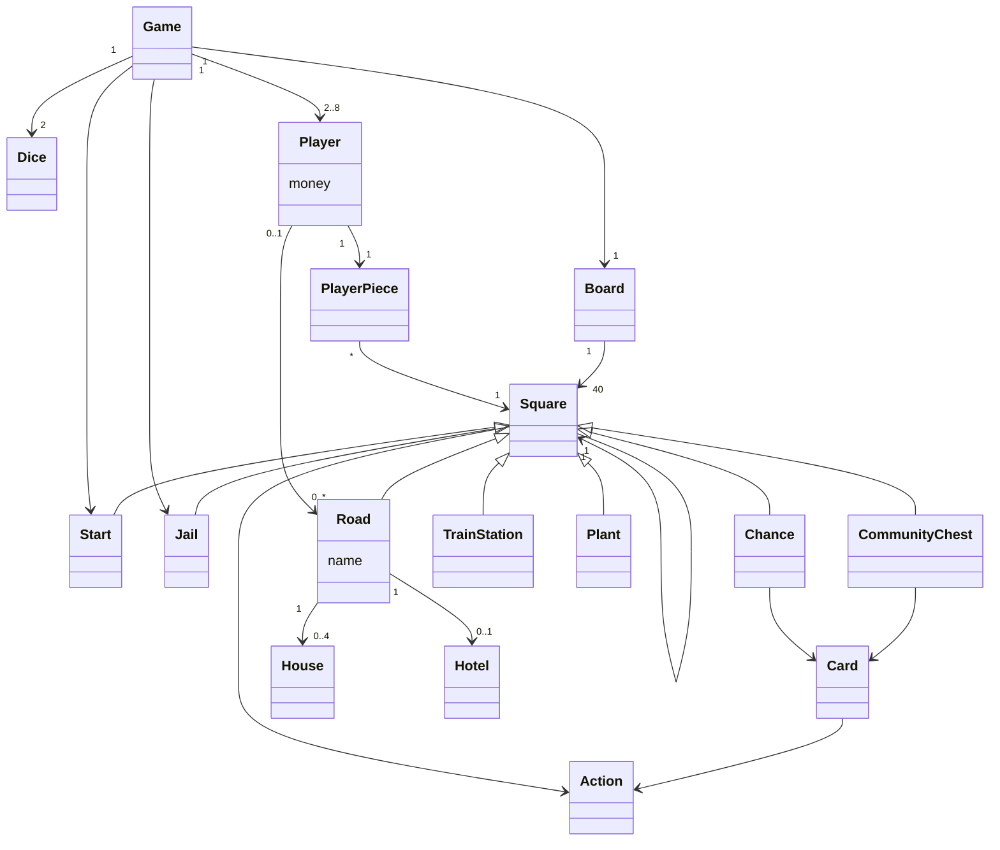

```mermaid
  classDiagram
      Game "1" --> "2" Dice
      Game "1" --> "1" Board
      Game "1" --> "2..8" Player
      Board "1" --> "40" Square
      Square "1" --> "1" Square
      Square <|-- Start
      Square <|-- Jail
      Square <|-- Chance
      Square <|-- CommunityChest
      Square <|-- TrainStation
      Square <|-- Plant
      Square <|-- Road
      Game --> Start
      Game --> Jail
      Player "1" --> "1" PlayerPiece
      PlayerPiece "*" --> "1" Square
      CommunityChest --> Card
      Chance --> Card
      Card --> Action
      Square --> Action
      Player "0..1" --> "0..*" Road
      Road "1" --> "0..4" House
      Road "1" --> "0..1" Hotel

      class Road{
          name
      }
      class Player{
          money
      }
      class Action

```
